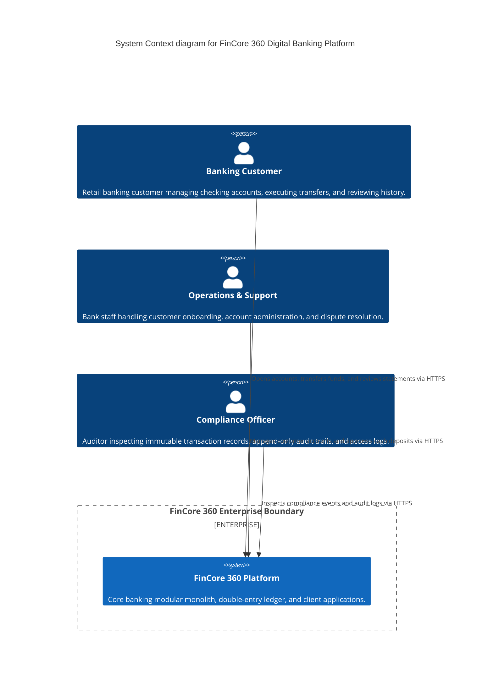
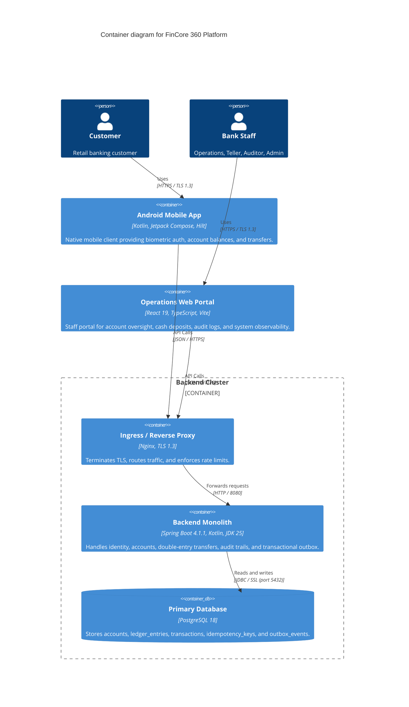

# FinCore 360 — C4 Architecture Diagrams

## 1. System Context Diagram (Level 1)

```mermaid
C4Context
    title System Context diagram for FinCore 360 Digital Banking Platform

    Person(customer, "Banking Customer", "Retail banking customer managing checking accounts, executing transfers, and reviewing history.")
    Person(operations, "Operations & Support", "Bank staff handling customer onboarding, account administration, and dispute resolution.")
    Person(auditor, "Compliance Officer", "Auditor inspecting immutable transaction records, append-only audit trails, and access logs.")

    Enterprise_Boundary(b0, "FinCore 360 Enterprise Boundary") {
        System(fincore, "FinCore 360 Platform", "Core banking modular monolith, double-entry ledger, and client applications.")
    }

    Rel(customer, fincore, "Opens accounts, transfers funds, and reviews statements via HTTPS")
    Rel(operations, fincore, "Manages customer accounts and approves cash deposits via HTTPS")
    Rel(auditor, fincore, "Inspects compliance events and audit logs via HTTPS")
```

## 2. Container Diagram (Level 2)

```mermaid
C4Container
    title Container diagram for FinCore 360 Platform

    Person(customer, "Customer", "Retail banking customer")
    Person(staff, "Bank Staff", "Operations, Teller, Auditor, Admin")

    Container(android_app, "Android Mobile App", "Kotlin, Jetpack Compose, Hilt", "Native mobile client providing biometric auth, account balances, and transfers.")
    Container(web_portal, "Operations Web Portal", "React 19, TypeScript, Vite", "Staff portal for account oversight, cash deposits, audit logs, and system observability.")

    Container_Boundary(backend_boundary, "Backend Cluster") {
        Container(api_gateway, "Ingress / Reverse Proxy", "Nginx, TLS 1.3", "Terminates TLS, routes traffic, and enforces rate limits.")
        Container(backend_api, "Backend Monolith", "Spring Boot 4.1.1, Kotlin, JDK 25", "Handles identity, accounts, double-entry transfers, audit trails, and transactional outbox.")
        ContainerDb(database, "Primary Database", "PostgreSQL 18", "Stores accounts, ledger_entries, transactions, idempotency_keys, and outbox_events.")
    }

    Rel(customer, android_app, "Uses", "HTTPS / TLS 1.3")
    Rel(staff, web_portal, "Uses", "HTTPS / TLS 1.3")

    Rel(android_app, api_gateway, "API Calls", "JSON / HTTPS")
    Rel(web_portal, api_gateway, "API Calls", "JSON / HTTPS")

    Rel(api_gateway, backend_api, "Forwards requests", "HTTP / 8080")
    Rel(backend_api, database, "Reads and writes", "JDBC / SSL (port 5432)")
```
